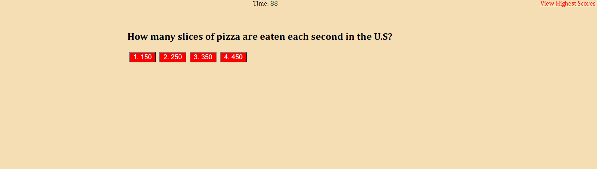
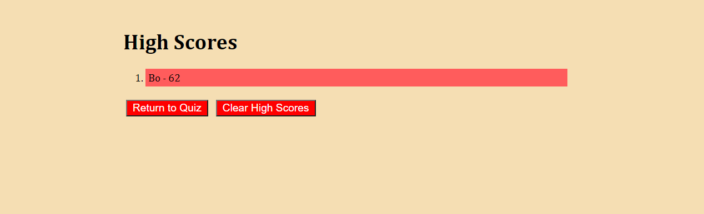

# code-quiz

## Overview

This repository is a quiz on pizza that is set on a timer that decreases upon an incorrect answer. Upon completion of all questions the user is presented with their final score and will be asked to enter their initials and have it saved it a list of high scores.

## Installation
* Visit https://github.com/bo-stevenson/code-quiz

* Clone the repository with Git Bash(Windows) or Terminal(Mac) in directory of your choosing. 
    $ git clone git@github.com:bo-stevenson/code-quiz.git 

## Usage

* Click start quiz to begin the timer and show the first question.

* Answer remaining questions to get to the finish screen. 

* A text box will appear to enter user initials. 

* Once initials are entered they will be placed within the High Score list. 

## Example

Project can be viewed at https://bo-stevenson.github.io/code-quiz/ 

## Credits

Bo Stevenson https://github.com/bo-stevenson 

## License 
MIT License

Copyright (c) [2020] [BoStevenson]

Permission is hereby granted, free of charge, to any person obtaining a copy
of this software and associated documentation files (the "Software"), to deal
in the Software without restriction, including without limitation the rights
to use, copy, modify, merge, publish, distribute, sublicense, and/or sell
copies of the Software, and to permit persons to whom the Software is
furnished to do so, subject to the following conditions:

The above copyright notice and this permission notice shall be included in all
copies or substantial portions of the Software.

THE SOFTWARE IS PROVIDED "AS IS", WITHOUT WARRANTY OF ANY KIND, EXPRESS OR
IMPLIED, INCLUDING BUT NOT LIMITED TO THE WARRANTIES OF MERCHANTABILITY,
FITNESS FOR A PARTICULAR PURPOSE AND NONINFRINGEMENT. IN NO EVENT SHALL THE
AUTHORS OR COPYRIGHT HOLDERS BE LIABLE FOR ANY CLAIM, DAMAGES OR OTHER
LIABILITY, WHETHER IN AN ACTION OF CONTRACT, TORT OR OTHERWISE, ARISING FROM,
OUT OF OR IN CONNECTION WITH THE SOFTWARE OR THE USE OR OTHER DEALINGS IN THE
SOFTWARE.   

